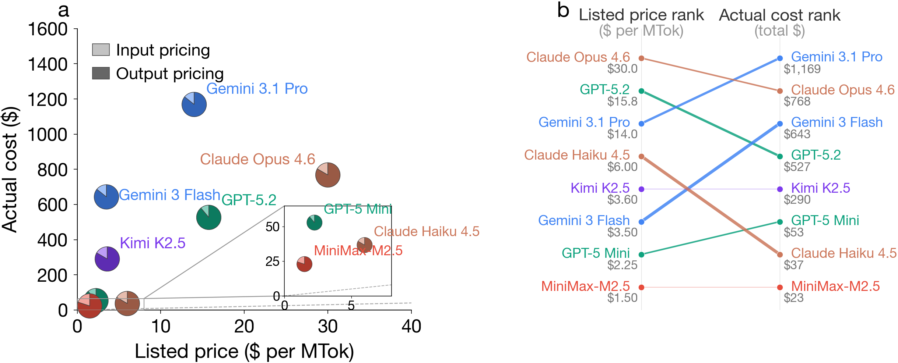

<p align="center">
  
</p>

# The Price Reversal Phenomenon: When Cheaper Reasoning Models End Up Costing More

[](https://arxiv.org/abs/2603.23971)
[](LICENSE)

This repository contains the data and code for our paper:

> **The Price Reversal Phenomenon: When Cheaper Reasoning Models End Up Costing More**
>
> [arXiv:2603.23971](https://arxiv.org/abs/2603.23971)

<p align="center">
  
</p>

## Key Findings

- **Pricing reversals are prevalent**: models with lower listed API prices frequently cost *more* in practice. For example, Gemini 3 Flash is listed at 1/5 the price of GPT-5.2 but costs 22% more on average across tasks.
- **Thinking tokens are the root cause**: hidden reasoning tokens vary dramatically across models (up to 860% difference in thinking token volume for the same query), and they dominate actual costs.
- **Predicting actual cost is hard**: even with KNN-based cost estimators, accurately forecasting per-query expenses remains an open challenge.

## Models & Pricing

We evaluate 8 model configurations from 5 providers:

| Model | Provider | Input ($/MTok) | Output ($/MTok) |
|-------|----------|:--------------:|:---------------:|
| GPT-5.2 | OpenAI | 1.75 | 14.00 |
| GPT-5 Mini | OpenAI | 0.25 | 2.00 |
| Gemini 3.1 Pro | Google | 2.00 | 12.00 |
| Gemini 3 Flash | Google | 0.50 | 3.00 |
| Claude Opus 4.6 | Anthropic | 5.00 | 25.00 |
| Claude Haiku 4.5 | Anthropic | 1.00 | 5.00 |
| Kimi K2.5 | Moonshot AI | 0.60 | 3.00 |
| MiniMax-M2.5 | MiniMax | 0.30 | 1.20 |

## Datasets

We benchmark across 9 diverse tasks (9 datasets × 8 models = 72 evaluation files):

| Dataset | Category | # Queries |
|---------|----------|:---------:|
| AIME | Math | 60 |
| ARC-AGI-v1 | Reasoning | 400 |
| ArenaHard | General | 750 |
| GPQA | Science | 198 |
| HLE | General | 2,056 |
| LiveCodeBench | Code | 1,054 |
| LiveMathBench | Math | 121 |
| MMLU-Pro | Knowledge | 3,000 |
| SimpleQA | QA | 4,326 |

## Repository Structure

```
├── asset/
│   └── logo.png                # Project logo
├── data/
│   ├── consolidated/           # 72 JSON files (9 datasets × 8 models)
│   │                           # Each contains per-query tokens, costs, scores
│   └── repeated_trial/         # Repeated trial data (5 runs × 3 models)
│       └── aime/{model}/run{0-4}.json
├── constant/
│   ├── model_info.json         # Model pricing information
│   └── experiment_config.json  # Dataset & model configurations
├── method/
│   ├── absolute_cost_estimator.py   # KNN-based absolute cost predictor (§6)
│   └── relative_cost_estimator.py   # KNN-based relative cost predictor (§6)
├── analysis/                   # Jupyter notebooks reproducing paper figures/tables
│   ├── price_expense_mismatch.ipynb       # Figure 1: price vs expense
│   ├── cost_token_breakdown.ipynb         # Cost & token breakdown charts
│   ├── difficulty_variance.ipynb          # Query difficulty vs thinking variance
│   ├── absolute_cost_evaluation.ipynb     # Absolute cost estimator evaluation
│   ├── relative_cost_evaluation.ipynb     # Relative cost estimator evaluation
│   └── scatter_plot.ipynb                 # Predicted vs actual cost scatter
├── app.py                      # Interactive Cost Explorer (Streamlit)
├── scripts/
│   ├── ablation_thinking_tokens.py        # §5 Ablation: cost without thinking tokens
│   ├── analyze_prevalence.py              # §4 Pricing reversal prevalence analysis
│   ├── analyze_perquery_variance.py       # Per-query cost variance analysis
│   ├── generate_ablation_figure.py        # Generate ablation figure
│   └── generate_repeated_trial_figure.py  # Generate repeated trial figure
└── figure/                     # Pre-generated paper figures (PNG + PDF)
```

## Data Format

Each file in `data/consolidated/` is a JSON object with:

**Top-level fields:**
| Field | Description |
|-------|-------------|
| `model_name` | Model identifier |
| `dataset_name` | Dataset identifier |
| `performance` | Overall accuracy/score |
| `cost` | Total cost in USD |
| `prompt_tokens` | Total prompt tokens |
| `completion_tokens` | Total completion tokens |
| `time_taken` | Total time in seconds |
| `records` | Array of per-query results |

**Per-query record fields:**
| Field | Description |
|-------|-------------|
| `index` | Query index |
| `prompt` | Input prompt text |
| `prompt_tokens` | Number of input tokens |
| `completion_tokens` | Number of output tokens (including thinking) |
| `thinking_tokens` | Number of reasoning/thinking tokens |
| `cost` | Cost in USD for this query |
| `score` | Correctness score (0.0 or 1.0) |
| `prediction` | Model's answer |
| `ground_truth` | Expected answer |
| `raw_output` | Full model output text |

## Quick Start

### Installation

Requires **Python 3.9+**.

```bash
git clone https://github.com/lchen001/pricing-reversal
cd pricing-reversal
conda create -n price-reversal python=3.12
conda activate price-reversal
pip install -r requirements.txt
```

### Interactive Cost Explorer

Launch the Streamlit app to interactively explore all data from the paper:

```bash
streamlit run app.py
```

Then open [http://localhost:8501](http://localhost:8501) in your browser. The app provides five views:

| View | What it shows |
|------|---------------|
| **� Pricing Reversal** | Listed price vs. actual expense for every dataset×model pair. Highlights cases where "cheaper" models cost more. |
| **📊 Cost Breakdown** | Per-model token and cost decomposition (prompt / thinking / completion) across datasets. |
| **� Per-Query Deep Dive** | Pick a dataset + query index to see every model's thinking tokens, cost, score, and **full response text** side by side. |
| **⚔️ Query-Level Comparison** | Select two models to compare query by query — scatter plots, reversal detection, and a drill-down with side-by-side responses and token details. |
| **🎲 Repeated Trial Variance** | Visualize how the same query sent to the same model 5× produces wildly different thinking token counts and costs (AIME dataset). |

### Reproduce Key Results

**Pricing reversal analysis (§4):**
```bash
python scripts/analyze_prevalence.py
```

**Thinking token ablation (§5):**
```bash
python scripts/ablation_thinking_tokens.py
```

**Generate figures:**
```bash
# Run from repo root
python scripts/generate_ablation_figure.py
python scripts/generate_repeated_trial_figure.py
```

**Analysis notebooks:** Open the notebooks in `analysis/` with Jupyter to reproduce the paper's figures and tables interactively.

## Citation

```bibtex
@article{thinkingtax2026,
  title={The Price Reversal Phenomenon: When Cheaper Reasoning Models End Up Costing More},
  author={Lingjiao Chen, Chi Zhang, Yeye He, Ion Stoica, Matei Zaharia, James Zou},
  journal={arXiv preprint arXiv:2603.23971},
  year={2026}
}
```

## License

This project is licensed under the MIT License — see [LICENSE](LICENSE) for details.
